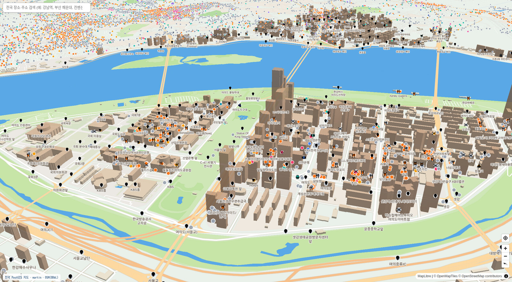
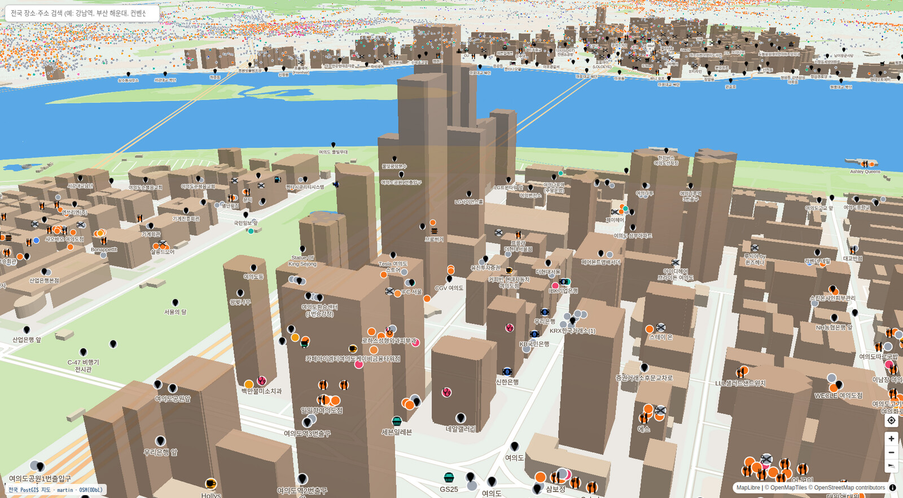
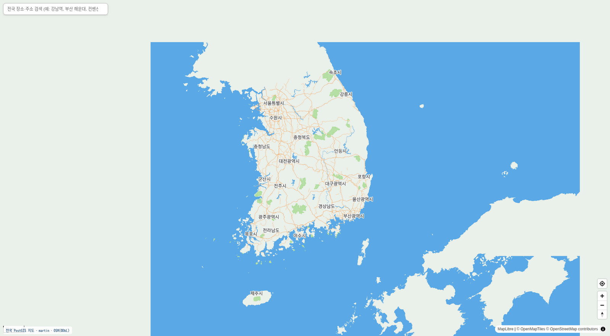
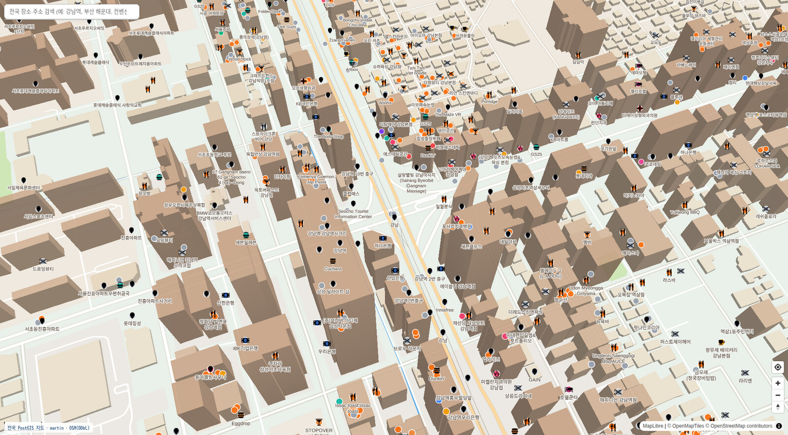
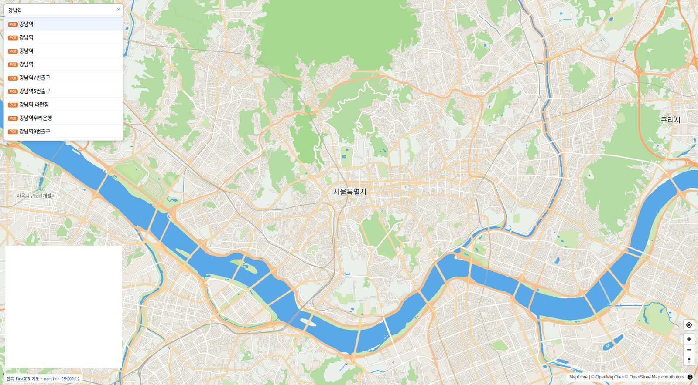
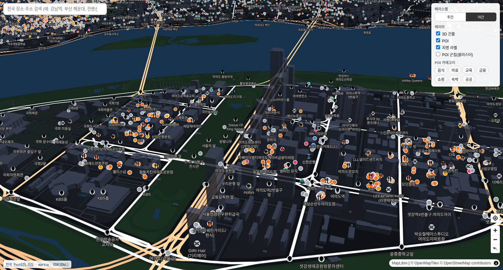
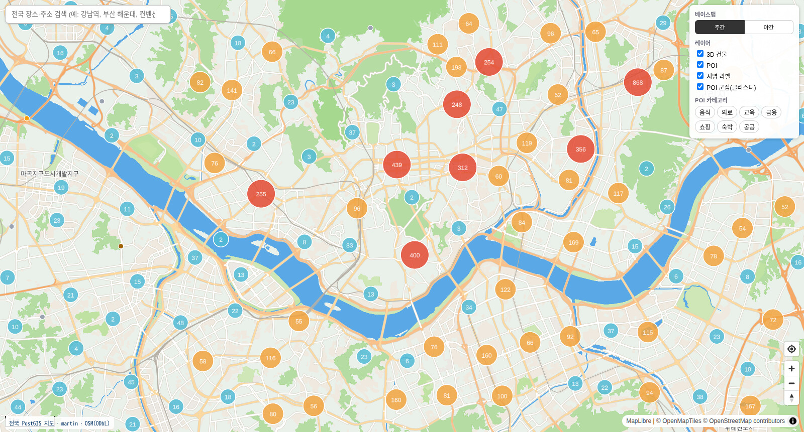
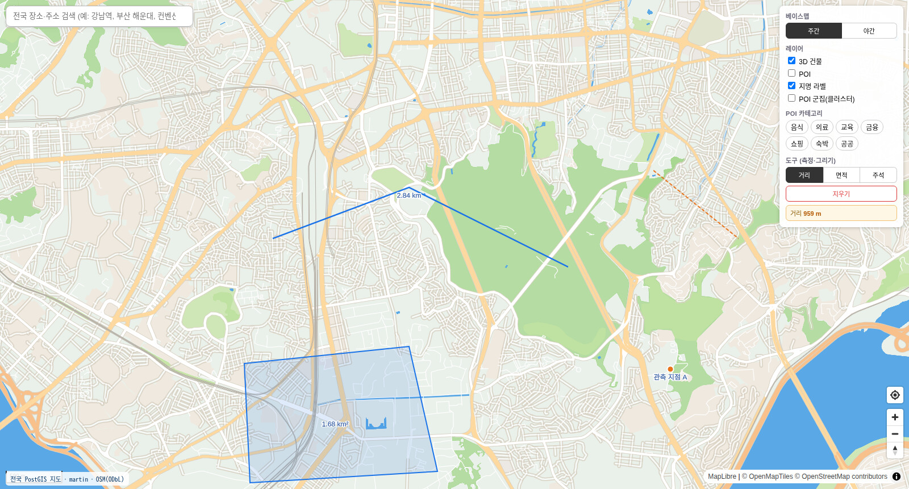
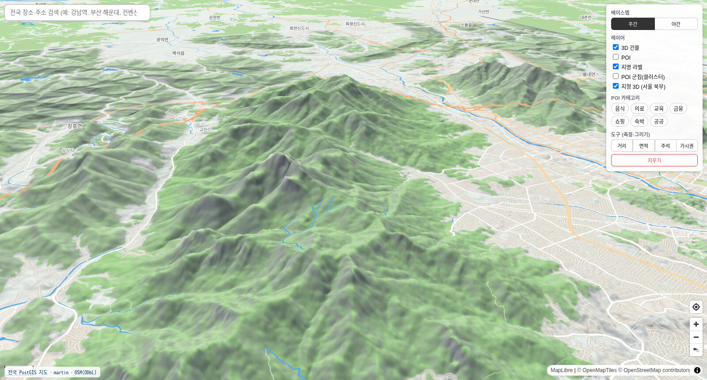
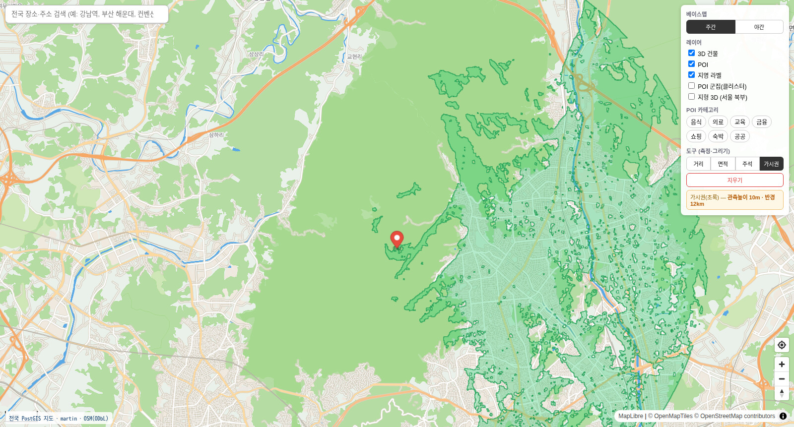

# offgrid-gis

서버 없이 도는, 자체 호스팅(self-hosted) 한국 지도 스택. 인터넷 없이 로컬에서
**벡터 지도 + POI/주소 검색 + 3D 건물**을 띄웁니다. 외부 지도 API에 의존하지 않고,
오픈 데이터(OpenStreetMap)로 타일을 직접 빌드해 서빙합니다.

> 베이스맵·POI·주소·3D 건물까지 모두 로컬에서 구동되는, 가볍고 오프라인 지향의
> 공간정보(GIS) 데모/툴킷입니다.

## 미리보기

서울 일대 (모든 화면은 자체 호스팅 타일 — 외부 지도 API 없음)



| 3D 건물 클로즈업 | 전국 커버리지 |
|---|---|
|  |  |
| **POI 카테고리 아이콘** | **장소·주소 검색** |
|  |  |
| **야간 테마 (3D)** | **POI 군집(클러스터링)** |
|  |  |

거리·면적 측정 + 그리기/주석



| 지형 3D (음영기복) | 가시권 분석 (line-of-sight) |
|---|---|
|  |  |

## 주요 기능

- **오프라인 벡터 베이스맵** — OpenStreetMap → planetiler로 직접 빌드한 PMTiles, martin으로 서빙
- **POI / 도로명주소 검색** — PostGIS + `pg_trgm` 유사검색(오타 허용), 전국 POI·주소
- **3D 건물** — MapLibre `fill-extrusion`. 전국(OSM 추정높이) + 일부 도시는 LiDAR 실측높이
- **건물 클릭 → 주소·높이 팝업**, POI 카테고리 아이콘·색상(Maki, CC0)
- **컨트롤 패널** — 주간/야간 베이스맵 전환, 레이어 토글(3D 건물·POI·지명), POI 카테고리 필터, POI 군집(클러스터링)
- **측정·그리기 도구** — 거리·면적 측정(지구 타원체 보정), 선/면 그리기, 마커 주석. 외부 라이브러리 없이 구현
- **지형 3D** — 로컬 terrain-RGB 타일로 음영기복(hillshade) + 3D 지형(MapLibre terrain)
- **가시권 분석(viewshed)** — 관측점에서 보이는 영역을 `gdal_viewshed`로 계산해 오버레이 (통신·감시·조망 분석)
- **단일 타일서버(martin)** 로 PMTiles·PostGIS·글리프·스프라이트 통합 서빙

## 아키텍처

```
브라우저 (MapLibre GL JS)
   │  벡터타일 / 글리프 / 스프라이트
   ▼
martin (Rust 타일서버, :3001) ── PMTiles(베이스맵) + PostGIS(건물·POI·주소)
   │
주소검색 서버 (addr_server.py, :8082) ── /search, /building_pois  (PostGIS pg_trgm)
```

## 기술 스택 & 라이선스

모두 영구 허용형(상업적 이용 가능) 라이선스입니다. 자세한 내역은 [`LICENSE_SBOM.md`](LICENSE_SBOM.md).

| 구성 | 도구 | 라이선스 |
|---|---|---|
| 지도 렌더 | MapLibre GL JS | BSD-3 |
| 타일서버 | martin | Apache-2.0 |
| 타일빌드 | planetiler | Apache-2.0 |
| 타일포맷 | PMTiles | BSD |
| 공간DB | PostGIS / PostgreSQL | LGPL / PostgreSQL |
| 아이콘 | Maki | CC0 |
| 지도 데이터 | OpenStreetMap | ODbL (출처표기 필요) |
| 글리프 | NanumGothic | OFL |

## 빠른 시작

> 대용량 데이터(`*.pmtiles`, LiDAR, 메시 등)와 `node_modules`는 리포에 포함되지
> 않습니다. 아래 순서로 생성·복원합니다.

### 1) 의존성

```bash
# PostgreSQL + PostGIS, martin, planetiler(JRE 필요), ogr2ogr(GDAL) 설치
cd viewer && npm install        # maplibre-gl, pmtiles 등 복원
```

### 2) 베이스맵 타일 빌드 (PMTiles)

```bash
# OSM south-korea.osm.pbf 내려받아 planetiler로 korea.pmtiles 생성
# (tools/planetiler 사용, 산출물은 viewer/korea.pmtiles 로 배치)
```

### 3) PostGIS 데이터 적재

```bash
export PGPASSWORD=<your_db_password>
# 전국 POI + 도로명주소 적재
scripts/extract_nationwide.sh
# (선택) 공식 도로명주소 DB 적재
scripts/load_official_juso.sh shp <SHP경로> 5179
```

### 3-1) (선택) 지형 3D / 가시권용 DEM 빌드

```bash
# terrarium 공개 DEM 타일 → 시범영역(서울 북부) DEM/terrain-RGB GeoTIFF
/usr/bin/python3 scripts/build_terrain_dem.py
# terrain-RGB → XYZ 타일(MapLibre raster-dem 용, 인코딩 보존 위해 near)
cd viewer && gdal2tiles.py --xyz -z 11-14 -r near -w none terrain_rgb.tif terrain
# 가시권은 addr_server의 /viewshed 가 terrain_dem.tif에 gdal_viewshed 를 실행
```

### 4) 서버 기동

```bash
export DATABASE_URL=postgresql://postgres:<password>@localhost:5432/gis
martin --config viewer/martin_config.yaml          # :3001
python3 viewer/addr_server.py 8082                  # :8082 (정적파일 + 검색API)
```

### 5) 열기

```
http://localhost:8082/address_demo.html
```

## 설정 (시크릿은 환경변수로)

리포에는 비밀번호가 하드코딩되어 있지 않습니다. 환경변수로 주입하세요.

| 변수 | 용도 |
|---|---|
| `DATABASE_URL` | martin → PostGIS 접속문자열 |
| `PGPASSWORD` | ogr2ogr/psql 적재 스크립트용 비밀번호 |
| `GIS_DSN` | `addr_server.py` 접속문자열 재정의(선택) |

## 디렉터리

```
scripts/   데이터 적재·빌드 스크립트 (LiDAR→메시, OSM→PostGIS, LOD1/LOD2 등)
viewer/    MapLibre 데모(HTML), martin 설정, 검색서버, 스프라이트
```

주요 진입점:
- `viewer/address_demo.html` — 통합 데모(전국 베이스맵 + POI/주소검색 + 3D 건물)
- `viewer/martin_config.yaml` — 타일서버 설정
- `viewer/addr_server.py` — 검색 API + 정적 서빙

## 데이터 출처 표기

지도 데이터 © OpenStreetMap contributors (ODbL). 스키마 © OpenMapTiles.
앱 화면 및 배포물에 위 출처를 반드시 표기하세요.

## 라이선스

코드: 별도 표기. 데이터·서드파티 구성요소는 각 라이선스를 따릅니다 — [`LICENSE_SBOM.md`](LICENSE_SBOM.md) 참고.
